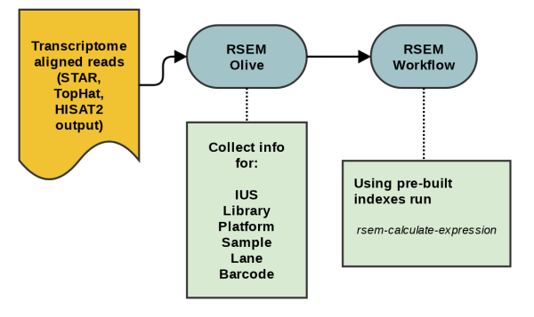

# RSEM

RSEM is a software package for estimating gene and isoform expression levels from RNA-Seq data. It has support for multi-threaded computation, can run on single-end and paired-end data and may produce statistic values in support of it's expression analysis. For visualization, It can generate BAM and Wiggle files in both transcript-coordinate and genomic-coordinate. For visualization, user may use RSEM-made bam and wiggle files with UCSC Genome browser or IGV browser from Broad Institute. RSEM can also make transcript read depth plots in pdf format. For this workflow, only limited subset of RSEM toolkit is used. This workflow provides a building block for RNAseq data analysis pipelines.




## Overview

## Dependencies

* [rsem 1.3.3](https://github.com/deweylab/RSEM)

## Usage

### Cromwell
```
java -jar cromwell.jar run rsem.wdl --inputs inputs.json

```

### Inputs

#### Required workflow parameters:
Parameter|Value|Description
---|---|---
`inputBam`|File|Input BAM file with aligned RNAseq reads.
`outputFileNamePrefix`|String|Output prefix, customizable. Default is the input file's basename.
`runRsem.rsemIndexDir`|String|Base of RSEM indexes, includes the directory common file prefix
`runRsem.modules`|String|Names and versions of modules


#### Optional task parameters:
Parameter|Value|Default|Description
---|---|---|---
`runRsem.timeout`|Int|48|Timeout in hours, needed to override imposed limits
`runRsem.jobMemory`|Int|12|Memory in Gb for this job


### Outputs

Output | Type | Description
---|---|---
`geneResults`|File|expression levels for all genes recorded in the reference
`isoformResults`|File|expression levels for all isoforms recorded in the reference
`transcriptBam`|File|BAM file with additional ZW:f:value, a single precision floating number representing the posterior probability


## Niassa + Cromwell

This WDL workflow is wrapped in a Niassa workflow (https://github.com/oicr-gsi/pipedev/tree/master/pipedev-niassa-cromwell-workflow) so that it can used with the Niassa metadata tracking system (https://github.com/oicr-gsi/niassa).

* Building
```
mvn clean install

```

* Testing
```
mvn clean verify \
-Djava_opts="-Xmx1g -XX:+UseG1GC -XX:+UseStringDeduplication" \
-DrunTestThreads=2 \
-DskipITs=false \
-DskipRunITs=false \
-DworkingDirectory=/path/to/tmp/ \
-DschedulingHost=niassa_oozie_host \
-DwebserviceUrl=http://niassa-url:8080 \
-DwebserviceUser=niassa_user \
-DwebservicePassword=niassa_user_password \
-Dcromwell-host=http://cromwell-url:8000

```

## Support

For support, please file an issue on the [Github project](https://github.com/oicr-gsi) or send an email to gsi@oicr.on.ca .

_Generated with generate-markdown-readme (https://github.com/oicr-gsi/gsi-wdl-tools/)_

